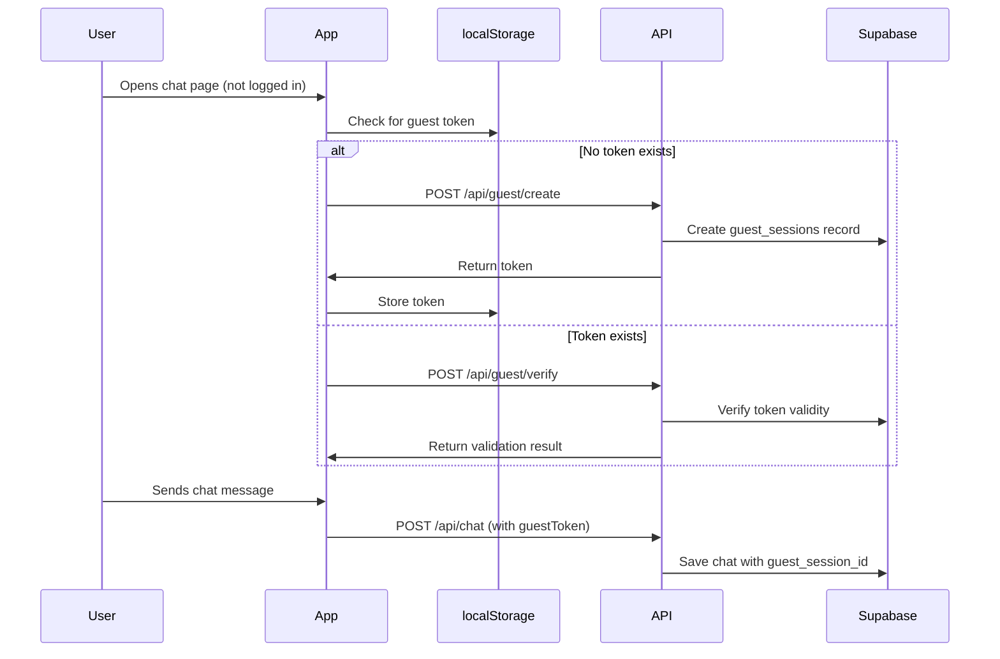
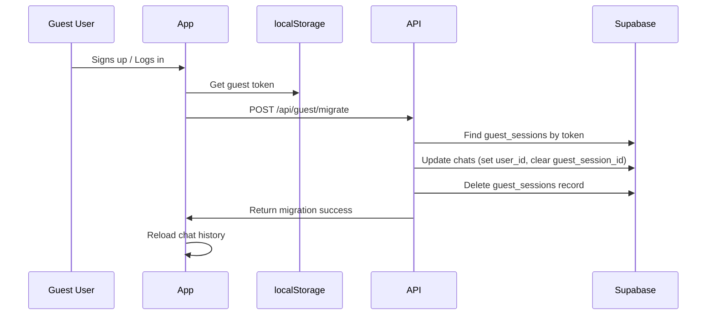
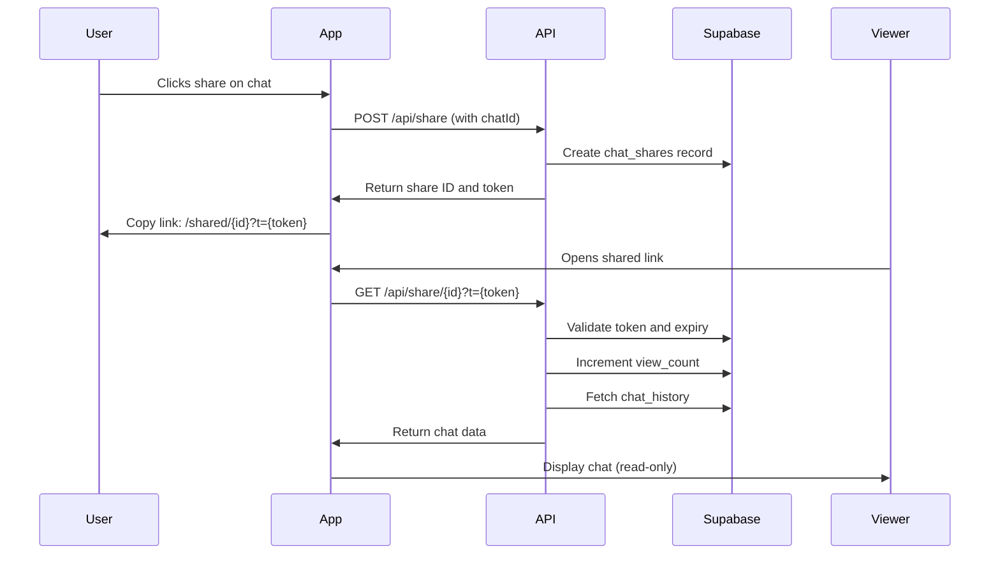

# Guest User Support & Live Chat Sharing

This document explains the new guest user support and live chat sharing features similar to Google Gemini.

## 🎯 Features Implemented

### 1. **Guest User Support**
- Non-logged-in users can now use the chat platform
- Guest sessions are automatically created and stored in localStorage
- Guest chat history is saved to Supabase
- Guest data is automatically migrated when users sign up/login

### 2. **Live Chat Sharing**
- Share any chat with a unique, tokenized link
- Shared chats can be viewed by anyone (logged in or not)
- Share links have configurable expiration (default: 30 days)
- View counter tracks how many times a shared link has been accessed

## 📁 Files Created/Modified

### New Files Created:
1. **`supabase-guest-support.sql`** - Database schema for guest support
2. **`lib/guestSession.ts`** - Guest session utilities
3. **`app/api/guest/create/route.ts`** - Create guest session API
4. **`app/api/guest/verify/route.ts`** - Verify guest session API
5. **`app/api/guest/migrate/route.ts`** - Migrate guest to user API
6. **`app/shared/[id]/page.tsx`** - Public shared chat viewing page

### Modified Files:
1. **`models/Chat.ts`** - Added guest_session_id support
2. **`app/api/chat/route.ts`** - Added guest user handling
3. **`app/api/history/route.ts`** - Added guest history retrieval
4. **`app/api/share/route.ts`** - Enhanced with public sharing
5. **`app/api/share/[id]/route.ts`** - Added view counter
6. **`app/chat/ChatClientPage.tsx`** - Added guest session management

## 🚀 Setup Instructions

### Step 1: Run Database Migration

Execute the new SQL file in your Supabase SQL Editor:

```bash
# In Supabase Dashboard > SQL Editor
# Run: supabase-guest-support.sql
```

This creates:
- `guest_sessions` table for tracking guest users
- Updates `chats` table to support guest_session_id
- Updates `chat_shares` table with is_public flag and view_count
- Adds necessary indexes and RLS policies

### Step 2: Verify Database Schema

After running the migration, verify the tables exist:

```sql
SELECT table_name 
FROM information_schema.tables 
WHERE table_schema = 'public' 
  AND table_name IN ('guest_sessions', 'chat_shares');
```

### Step 3: Test Guest User Flow

1. **Open the app without logging in**
   - A guest session is automatically created
   - Guest token is stored in localStorage
   - Chats are saved to database with guest_session_id

2. **Sign up or login**
   - Guest data is automatically migrated to your account
   - All previous chats are now associated with your user account

### Step 4: Test Chat Sharing

1. **Create/Select a chat**
2. **Click the share button**
3. **Share link is generated**: `/shared/{id}?t={token}`
4. **Open link in incognito/different device**
   - Chat is viewable without authentication
   - Works for both logged-in and non-logged-in users

## 🔧 How It Works

### Guest Session Flow



### Migration Flow (Guest → User)



### Share Link Flow



## 🗄️ Database Schema

### guest_sessions
```sql
CREATE TABLE public.guest_sessions (
  id UUID DEFAULT gen_random_uuid() PRIMARY KEY,
  session_token TEXT UNIQUE NOT NULL,
  created_at TIMESTAMPTZ DEFAULT NOW(),
  expires_at TIMESTAMPTZ DEFAULT (NOW() + INTERVAL '30 days'),
  last_activity TIMESTAMPTZ DEFAULT NOW()
);
```

### chats (updated)
```sql
ALTER TABLE public.chats 
  ADD COLUMN guest_session_id UUID REFERENCES guest_sessions(id) ON DELETE CASCADE;
  
-- Either user_id or guest_session_id must be set
ALTER TABLE public.chats 
  ADD CONSTRAINT chats_user_or_guest_check 
  CHECK (user_id IS NOT NULL OR guest_session_id IS NOT NULL);
```

### chat_shares (updated)
```sql
ALTER TABLE public.chat_shares 
  ADD COLUMN is_public BOOLEAN DEFAULT TRUE,
  ADD COLUMN view_count INTEGER DEFAULT 0;
```

## 🔐 Security Considerations

1. **Guest Sessions Expire**: Default 30 days, configurable
2. **Share Links Expire**: Default 7 days, configurable (1-365 days)
3. **Token-Based Access**: Both guest sessions and shares use secure tokens
4. **RLS Enabled**: Row Level Security is enabled on all tables
5. **No Personal Data**: Guest sessions don't collect personal information
6. **Automatic Cleanup**: Expired guest sessions cascade delete their chats

## 🎨 User Experience Features

### For Guest Users:
- ✅ Immediate access without signup
- ✅ Full chat functionality
- ✅ Chat history preserved
- ✅ Seamless migration on signup
- ✅ No data loss

### For Authenticated Users:
- ✅ All guest features plus:
- ✅ Persistent account across devices
- ✅ Share chats publicly
- ✅ Access to additional features

### For Shared Chat Viewers:
- ✅ View chats without login
- ✅ Clean, read-only interface
- ✅ Copy share link button
- ✅ Encouragement to sign up (footer CTA)

## 📊 API Endpoints

### Guest Management
- `POST /api/guest/create` - Create new guest session
- `POST /api/guest/verify` - Verify guest token validity
- `POST /api/guest/migrate` - Migrate guest data to user account

### Chat Operations (Enhanced)
- `POST /api/chat` - Now accepts `guestToken` parameter
- `GET /api/history` - Now accepts `?guestToken=xxx` query parameter

### Sharing
- `POST /api/share` - Create share link with optional `isPublic` flag
- `GET /api/share/[id]` - Get shared chat (increments view_count)

### Public Views
- `GET /shared/[id]?t=[token]` - View shared chat page

## 🧪 Testing Checklist

- [ ] Guest user can chat without login
- [ ] Guest chat history loads correctly
- [ ] Guest data migrates on signup
- [ ] Share button generates valid link
- [ ] Shared link works in incognito mode
- [ ] Shared link works on different device
- [ ] Shared link expires after set time
- [ ] View counter increments
- [ ] Guest session expires after 30 days
- [ ] Multiple guest sessions work independently

## 🐛 Troubleshooting

### Guest session not created
- Check browser localStorage is enabled
- Check `/api/guest/create` endpoint returns 200
- Check Supabase connection

### Share link doesn't work
- Verify `chat_shares` table exists
- Check token in URL matches database
- Verify expiry date hasn't passed
- Check `is_public` flag is true

### Guest data not migrating
- Check guest token exists in localStorage
- Verify `/api/guest/migrate` endpoint
- Check user is authenticated when migration runs

## 🔄 Cleanup & Maintenance

### Manual Cleanup (Optional)
```sql
-- Delete expired guest sessions
DELETE FROM public.guest_sessions 
WHERE expires_at < NOW();

-- Delete expired share links
DELETE FROM public.chat_shares 
WHERE expires_at < NOW();
```

### Automated Cleanup
Consider setting up a cron job or Supabase Edge Function to run cleanup periodically.

## 📈 Future Enhancements

Potential improvements:
- [ ] Rich embed previews for shared links
- [ ] Password-protected shares
- [ ] Share analytics dashboard
- [ ] Guest to user account linking (merge multiple sessions)
- [ ] Export chat as PDF/HTML
- [ ] Custom share link aliases

## ✅ Summary

You now have a complete guest user system with live chat sharing functionality similar to Google Gemini! Users can:

1. **Use the platform immediately** without signup
2. **Share chats with anyone** via secure links  
3. **View shared chats** without authentication
4. **Seamlessly migrate** guest data when they sign up

All chat data is preserved in Supabase, with proper security and automatic cleanup of expired sessions.
